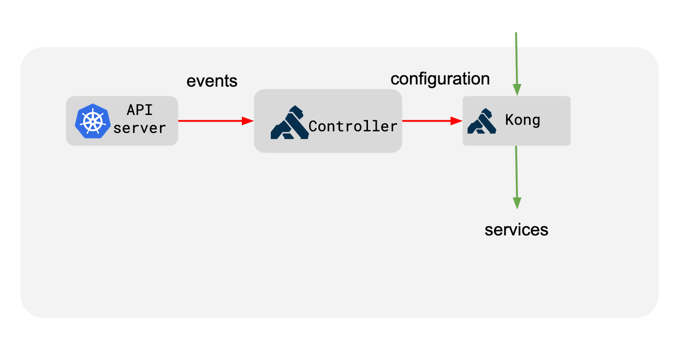
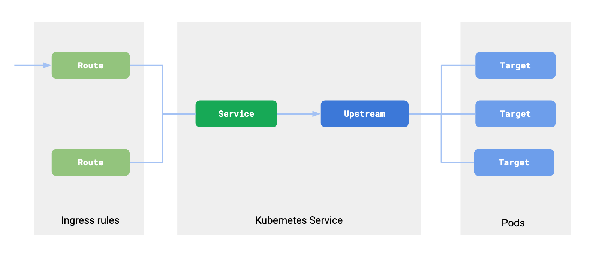

# Kong Gateway Keycloack

## Kong API Gateway

### Terminology

  
Service

   
  A Service in Kong represents an upstream API or microservice. It acts as an abstraction layer for the actual backend service. When you define a service, you specify the connection details to the upstream application, such as the `URL`, `protocol`, `host`, `port`, and `path`.
  

  
Route

   

  A Route defines how incoming requests are matched and forwarded to a service. Routes contain rules that determine which requests should be proxied to which services. These rules can be based on `paths`, `methods`, `headers`, or other request attributes.
  

  
Upstream Application

   

  An Upstream Application is the actual backend service that handles the requests forwarded by Kong. In Kong, an upstream object can represent a group of backend servers, allowing for load balancing and health checks.
  

  
Relationship between Service & Route & Upstream application

   

  **Route to Service:** A single route can be mapped to a single service. This means that a specific path or request pattern will always be directed to one particular service.

  _Example:_ A route `/api/v1/users` is mapped to a service `user-service`.
  
  **Service to Upstream Applications:** A single service can be associated with multiple upstream applications. This is useful for load balancing and redundancy.

   _Example:_ The `user-service ` can forward requests to multiple instances of the user API running on different servers.

   **Routes to Service:** Multiple routes can be mapped to a single service. This allows different paths or request patterns to be handled by the same backend service.

   _Example:_ Routes `/api/v1/users` and `/api/v1/profiles` both map to the `user-service`.
  

### Fundamental concepts

  
How Kong API work?

   

  + **Client Request:** A client sends a request to Kong.
  + **Route Matching:** Kong evaluates the request against the defined routes to find a match. Routes can be configured to match based on URL paths, HTTP methods, headers, etc.
  + **Service Forwarding:** Once a route is matched, Kong forwards the request to the associated service.
  + **Upstream Handling:** The service then directs the request to the upstream application, which processes the request and sends back a response.
  + **Response:** The response from the upstream application is sent back through the service and route, eventually reaching the client.

  _Example:_ Imagine you have a service called `example-service` that points to an upstream API at `http://example.com`. You create a route that matches requests with the path `/example` and associates it with `example-service`. When a client makes a request to `http://kong-gateway.com/example`, Kong matches this request to the route, forwards it to `example-service`, which then proxies it to `http://example.com`.

### Kong Ingress Controller

  
Architecture of Kong Ingress Controller

   

  Kong Ingress Controller configures using Ingress resources created inside a Kubernetes cluster.

  

  The Controller listens for the changes inside the Kubernetes cluster and updates Kong in response to those changes. So that it can correctly proxy all the traffic. 

  _Note:_ All requests flowing through Kong are not directed through **kube-proxy** but directly to the **Pod**.
  

  
Ingress in Kong

   

  An Ingress resource in Kubernetes defines a set of rules for proxying traffic. These rules correspond to the concept of a route in Kong.

  
  

### Kong plugin

  
How Kong API work?

   

  
  

